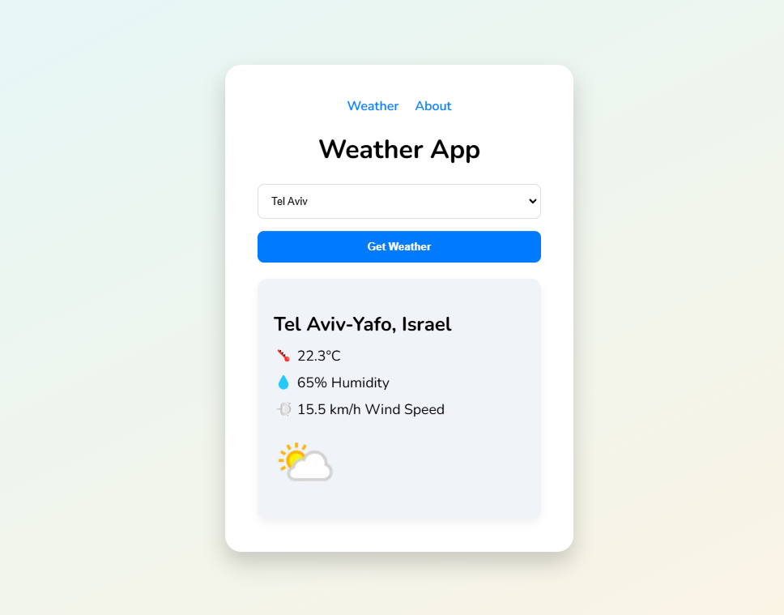

# 🌤️ Weather App

A simple, responsive weather application built using **React** and **WeatherAPI**. Users can select a city from a list to get real-time weather information, including temperature, humidity, wind speed, and weather conditions.

## 🛠️ Features
- Select a city to get the current weather.
- Displays temperature, humidity, wind speed, and an icon representing the weather.
- Modern, responsive UI with smooth hover effects.
- Error handling for incorrect city selections.

## 🚀 Demo
Check out the live demo: [Weather App Demo](#)  
*(You can update this link once you deploy your app.)*

## 📸 Screenshots


## 🛠️ Technologies Used
- **React**: JavaScript library for building the user interface.
- **Axios**: For fetching data from WeatherAPI.
- **React Router**: For navigation between pages.
- **CSS**: For styling the app.

## 🔧 Installation & Setup
To run this project locally:

1. Clone the repository:
   ```bash
   git clone https://github.com/yourusername/weather-app.git
   cd weather-app
